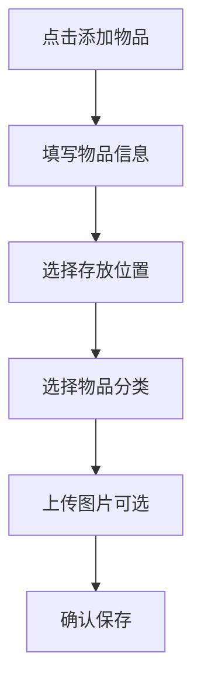
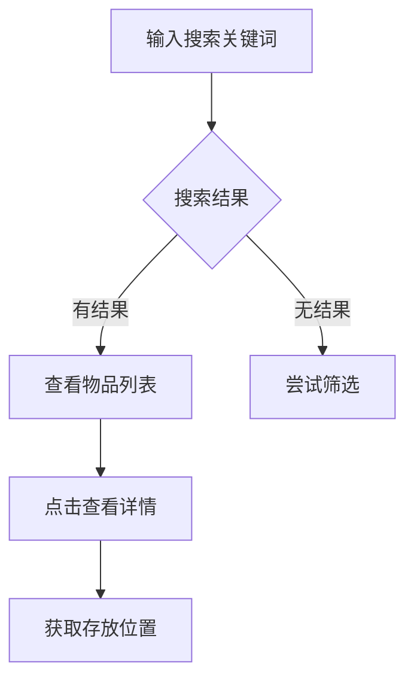

# 家庭物品存放管理程序 - 产品需求文档

## 1. 产品概述

一款优雅的家庭物品存放管理Web应用，帮助用户轻松追踪家中物品的存放位置，解决"东西放在哪里了"的困扰。

### 核心价值
- 快速定位物品，再也不怕找不到东西
- 直观管理家中每一件物品
- 清晰的存储空间规划

### 目标用户
- 家庭用户
- 整理爱好者
- 需要管理大量日常用品的用户

## 2. 核心功能

### 2.1 功能模块

1. **首页仪表盘**
   - 物品统计概览
   - 最近添加的物品
   - 存储空间使用情况
   - 快速搜索入口

2. **物品管理**
   - 添加新物品（名称、描述、分类、数量、存放位置、图片）
   - 编辑物品信息
   - 删除物品
   - 查看物品详情

3. **位置管理**
   - 房间管理（客厅、卧室、厨房等）
   - 子位置管理（柜子、抽屉、架子等）
   - 位置层级导航
   - 位置容量显示

4. **分类管理**
   - 系统预设分类（电器、衣物、书籍、食品、工具等）
   - 自定义分类
   - 分类颜色标记

5. **搜索与筛选**
   - 关键词全文搜索
   - 按分类筛选
   - 按位置筛选
   - 按日期筛选

## 3. 核心流程

### 3.1 添加物品流程


### 3.2 查找物品流程


## 4. 用户界面设计

### 4.1 设计风格
- **主题**: 温暖生活风格 - 简约但不冷淡，温馨的家居感
- **色调**: 温暖的米白色为主，搭配柔和的绿色和橙色点缀
- **字体**: 思源黑体（简体中文）+ Nunito（英文/数字）
- **布局**: 左侧导航 + 右侧内容区的经典后台布局
- **图标**: Lucide Icons 简洁线性风格

### 4.2 色彩方案
```
--primary: #4A7C59      // 森林绿 - 主色调
--secondary: #E8A87C    // 暖橙色 - 辅助色
--accent: #C38D9E       // 玫瑰粉 - 强调色
--background: #FAF8F5   // 米白色 - 背景色
--surface: #FFFFFF      // 纯白 - 卡片背景
--text-primary: #2D3436  // 深灰 - 主文字
--text-secondary: #636E72 // 中灰 - 次要文字
--border: #E0DCD5       // 浅灰 - 边框色
```

### 4.3 页面设计

#### 首页仪表盘
- 顶部欢迎语 + 天气信息（装饰性）
- 四格统计卡片（总物品数、房间数、分类数、最近添加）
- 快速搜索栏
- 最近添加物品列表（卡片形式）
- 存储空间使用进度条

#### 物品列表页
- 顶部筛选栏（分类、位置、搜索）
- 物品卡片网格展示
- 卡片显示：图片、名称、位置、分类标签
- 悬浮显示快捷操作（编辑、删除）

#### 物品详情页
- 大图展示区
- 物品信息卡片（名称、描述、数量、分类、位置）
- 位置导航面包屑
- 操作按钮（编辑、删除）

#### 位置管理页
- 树形结构展示位置层级
- 左侧房间列表 + 右侧子位置编辑
- 可视化容量指示器

### 4.4 响应式设计
- 桌面优先设计
- 平板适配（折叠侧边栏）
- 移动端适配（底部导航）

## 5. 技术架构

### 5.1 技术栈
- **前端框架**: React 18 + TypeScript
- **构建工具**: Vite
- **样式方案**: Tailwind CSS
- **图标库**: Lucide React
- **数据存储**: LocalStorage（本地持久化）
- **路由**: React Router v6

### 5.2 数据模型

#### 物品 (Item)
```typescript
interface Item {
  id: string;
  name: string;
  description?: string;
  categoryId: string;
  locationId: string;
  quantity: number;
  imageUrl?: string;
  createdAt: string;
  updatedAt: string;
}
```

#### 位置 (Location)
```typescript
interface Location {
  id: string;
  name: string;
  parentId?: string;  // 顶级位置为 undefined
  type: 'room' | 'cabinet' | 'drawer' | 'shelf' | 'box';
  color?: string;
}
```

#### 分类 (Category)
```typescript
interface Category {
  id: string;
  name: string;
  icon: string;
  color: string;
}
```

### 5.3 路由设计
| 路由 | 页面 |
|------|------|
| / | 首页仪表盘 |
| /items | 物品列表 |
| /items/:id | 物品详情 |
| /items/new | 添加物品 |
| /items/:id/edit | 编辑物品 |
| /locations | 位置管理 |
| /categories | 分类管理 |
| /search | 搜索结果 |

## 6. 预设数据

### 6.1 预设分类
| 分类名 | 图标 | 颜色 |
|--------|------|------|
| 电器 | tv | #4A7C59 |
| 衣物 | shirt | #E8A87C |
| 书籍 | book-open | #C38D9E |
| 食品 | apple | #85DCB |
| 工具 | wrench | #F0A500 |
| 清洁用品 | sparkles | #00B4D8 |
| 文件 | file-text | #90BE6D |
| 其他 | box | #9B9B9B |

### 6.2 预设位置
| 位置名 | 类型 | 父级 |
|--------|------|------|
| 客厅 | room | - |
| 卧室 | room | - |
| 厨房 | room | - |
| 卫生间 | room | - |
| 书房 | room | - |
| 阳台 | room | - |
| 电视柜 | cabinet | 客厅 |
| 衣柜 | cabinet | 卧室 |
| 书柜 | cabinet | 书房 |
| 厨房抽屉 | drawer | 厨房 |
