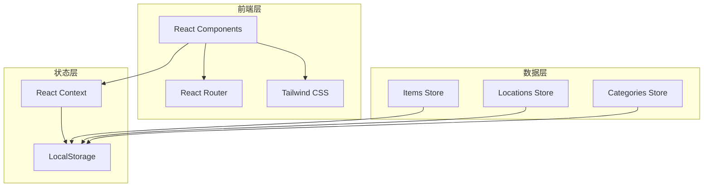

# 家庭物品存放管理程序 - 技术架构文档

## 1. 架构设计



## 2. 技术选型

| 技术 | 版本 | 用途 |
|------|------|------|
| React | 18.x | UI框架 |
| TypeScript | 5.x | 类型安全 |
| Vite | 5.x | 构建工具 |
| Tailwind CSS | 3.x | 样式方案 |
| Lucide React | 最新 | 图标库 |
| React Router | 6.x | 路由管理 |
| React Context | 内置 | 状态管理 |
| nanoid | 最新 | ID生成 |

## 3. 项目结构

```
src/
├── components/          # 通用组件
│   ├── Layout/         # 布局组件
│   ├── Card/           # 卡片组件
│   ├── Button/         # 按钮组件
│   └── Modal/          # 模态框组件
├── pages/              # 页面组件
│   ├── Dashboard/      # 首页仪表盘
│   ├── Items/          # 物品管理
│   ├── Locations/      # 位置管理
│   ├── Categories/     # 分类管理
│   └── Search/         # 搜索页面
├── context/            # React Context
│   ├── ItemsContext.tsx
│   ├── LocationsContext.tsx
│   └── CategoriesContext.tsx
├── hooks/              # 自定义Hooks
├── types/              # TypeScript类型
├── utils/              # 工具函数
├── data/               # 预设数据
└── App.tsx             # 根组件
```

## 4. 路由定义

| 路由 | 组件 | 描述 |
|------|------|------|
| / | Dashboard | 首页仪表盘 |
| /items | ItemsList | 物品列表 |
| /items/new | ItemForm | 添加物品 |
| /items/:id | ItemDetail | 物品详情 |
| /items/:id/edit | ItemForm | 编辑物品 |
| /locations | Locations | 位置管理 |
| /categories | Categories | 分类管理 |
| /search | Search | 搜索结果 |

## 5. 数据模型

### 5.1 物品 (Item)
```typescript
interface Item {
  id: string;
  name: string;
  description: string;
  categoryId: string;
  locationId: string;
  quantity: number;
  imageUrl: string;
  createdAt: string;
  updatedAt: string;
}
```

### 5.2 位置 (Location)
```typescript
interface Location {
  id: string;
  name: string;
  parentId: string | undefined;
  type: 'room' | 'cabinet' | 'drawer' | 'shelf' | 'box';
  color: string;
}
```

### 5.3 分类 (Category)
```typescript
interface Category {
  id: string;
  name: string;
  icon: string;
  color: string;
}
```

## 6. Context API 设计

### 6.1 ItemsContext
- `items: Item[]` - 物品列表
- `addItem(item: Item): void` - 添加物品
- `updateItem(id: string, item: Partial<Item>): void` - 更新物品
- `deleteItem(id: string): void` - 删除物品
- `getItemById(id: string): Item | undefined` - 获取单个物品

### 6.2 LocationsContext
- `locations: Location[]` - 位置列表
- `addLocation(location: Location): void` - 添加位置
- `updateLocation(id: string, location: Partial<Location>): void` - 更新位置
- `deleteLocation(id: string): void` - 删除位置
- `getLocationById(id: string): Location | undefined` - 获取单个位置
- `getChildLocations(parentId: string): Location[]` - 获取子位置

### 6.3 CategoriesContext
- `categories: Category[]` - 分类列表
- `addCategory(category: Category): void` - 添加分类
- `updateCategory(id: string, category: Partial<Category>): void` - 更新分类
- `deleteCategory(id: string): void` - 删除分类

## 7. 组件清单

### 7.1 布局组件
- `Sidebar` - 侧边导航栏
- `Header` - 顶部栏
- `MainLayout` - 主布局容器

### 7.2 通用组件
- `Button` - 按钮组件
- `Card` - 卡片组件
- `Input` - 输入框组件
- `Select` - 选择器组件
- `Modal` - 模态框组件
- `Badge` - 标签组件
- `EmptyState` - 空状态组件

### 7.3 业务组件
- `ItemCard` - 物品卡片
- `LocationTree` - 位置树形结构
- `CategoryBadge` - 分类标签
- `StatCard` - 统计卡片
- `SearchBar` - 搜索栏
- `ImageUpload` - 图片上传

## 8. 样式规范

### 8.1 CSS变量
```css
:root {
  --primary: #4A7C59;
  --secondary: #E8A87C;
  --accent: #C38D9E;
  --background: #FAF8F5;
  --surface: #FFFFFF;
  --text-primary: #2D3436;
  --text-secondary: #636E72;
  --border: #E0DCD5;
  --success: #4CAF50;
  --warning: #FFC107;
  --error: #F44336;
}
```

### 8.2 动画效果
- 页面切换：fade-in 300ms ease-out
- 卡片悬浮：translateY(-4px) + shadow 200ms
- 按钮点击：scale(0.98) 100ms
- 列表加载：staggered fade-in 50ms delay between items

## 9. 数据初始化

首次加载时，从 LocalStorage 读取数据，如无数据则使用预设数据初始化：

### 预设分类（8个）
### 预设位置（10个，包含层级关系）
### 示例物品数据（5-8个）
